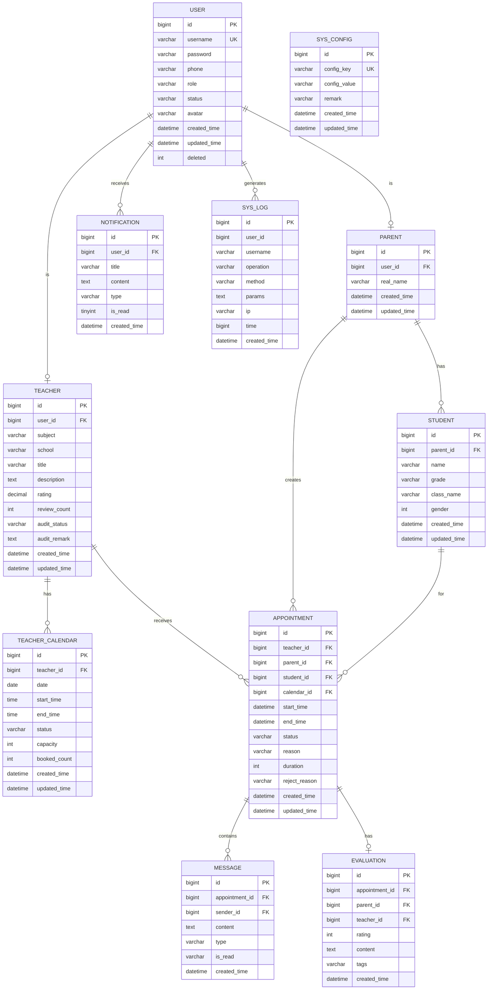

# 数据库ER图设计

## ER图（Mermaid格式）

## 数据表说明

### 1. user 用户表
存储系统所有用户的基本信息，包括家长、教师、管理员。

| 字段名 | 类型 | 说明 | 约束 |
|--------|------|------|------|
| id | bigint | 主键ID | PRIMARY KEY, AUTO_INCREMENT |
| username | varchar(50) | 用户名 | UNIQUE, NOT NULL |
| password | varchar(100) | 密码（BCrypt加密） | NOT NULL |
| phone | varchar(20) | 手机号 | |
| role | varchar(20) | 角色：PARENT/TEACHER/ADMIN | NOT NULL |
| status | varchar(20) | 状态：NORMAL/DISABLED | DEFAULT 'NORMAL' |
| avatar | varchar(255) | 头像URL | |
| created_time | datetime | 创建时间 | DEFAULT CURRENT_TIMESTAMP |
| updated_time | datetime | 更新时间 | DEFAULT CURRENT_TIMESTAMP ON UPDATE |
| deleted | int | 逻辑删除标志 | DEFAULT 0 |

### 2. teacher 教师表
存储教师的详细职业信息。

| 字段名 | 类型 | 说明 | 约束 |
|--------|------|------|------|
| id | bigint | 主键ID | PRIMARY KEY, AUTO_INCREMENT |
| user_id | bigint | 关联用户ID | FOREIGN KEY, UNIQUE |
| subject | varchar(50) | 教授学科 | |
| school | varchar(100) | 所在学校 | |
| title | varchar(50) | 职称 | |
| description | text | 个人简介 | |
| rating | decimal(2,1) | 综合评分 | DEFAULT 0.0 |
| review_count | int | 评价数量 | DEFAULT 0 |
| audit_status | varchar(20) | 审核状态：PENDING/APPROVED/REJECTED | DEFAULT 'PENDING' |
| audit_remark | text | 审核意见 | |
| created_time | datetime | 创建时间 | DEFAULT CURRENT_TIMESTAMP |
| updated_time | datetime | 更新时间 | DEFAULT CURRENT_TIMESTAMP ON UPDATE |

### 3. parent 家长表
存储家长的基本信息。

| 字段名 | 类型 | 说明 | 约束 |
|--------|------|------|------|
| id | bigint | 主键ID | PRIMARY KEY, AUTO_INCREMENT |
| user_id | bigint | 关联用户ID | FOREIGN KEY, UNIQUE |
| real_name | varchar(50) | 真实姓名 | |
| created_time | datetime | 创建时间 | DEFAULT CURRENT_TIMESTAMP |
| updated_time | datetime | 更新时间 | DEFAULT CURRENT_TIMESTAMP ON UPDATE |

### 4. student 学生表
存储学生信息，一个家长可关联多个学生。

| 字段名 | 类型 | 说明 | 约束 |
|--------|------|------|------|
| id | bigint | 主键ID | PRIMARY KEY, AUTO_INCREMENT |
| parent_id | bigint | 关联家长ID | FOREIGN KEY |
| name | varchar(50) | 学生姓名 | NOT NULL |
| grade | varchar(50) | 年级 | |
| class_name | varchar(50) | 班级 | |
| gender | int | 性别：1男 2女 | |
| created_time | datetime | 创建时间 | DEFAULT CURRENT_TIMESTAMP |
| updated_time | datetime | 更新时间 | DEFAULT CURRENT_TIMESTAMP ON UPDATE |

### 5. teacher_calendar 教师时间表
存储教师可预约的时间段。

| 字段名 | 类型 | 说明 | 约束 |
|--------|------|------|------|
| id | bigint | 主键ID | PRIMARY KEY, AUTO_INCREMENT |
| teacher_id | bigint | 关联教师ID | FOREIGN KEY |
| date | date | 日期 | NOT NULL |
| start_time | time | 开始时间 | NOT NULL |
| end_time | time | 结束时间 | NOT NULL |
| status | varchar(20) | 状态：AVAILABLE/FULL/CLOSED | DEFAULT 'AVAILABLE' |
| capacity | int | 可预约人数 | DEFAULT 1 |
| booked_count | int | 已预约人数 | DEFAULT 0 |
| created_time | datetime | 创建时间 | DEFAULT CURRENT_TIMESTAMP |
| updated_time | datetime | 更新时间 | DEFAULT CURRENT_TIMESTAMP ON UPDATE |

### 6. appointment 预约表（核心表）
存储预约申请信息。

| 字段名 | 类型 | 说明 | 约束 |
|--------|------|------|------|
| id | bigint | 主键ID | PRIMARY KEY, AUTO_INCREMENT |
| teacher_id | bigint | 教师ID | FOREIGN KEY, NOT NULL |
| parent_id | bigint | 家长ID | FOREIGN KEY, NOT NULL |
| student_id | bigint | 学生ID | FOREIGN KEY |
| calendar_id | bigint | 关联时间表ID | FOREIGN KEY |
| start_time | datetime | 开始时间 | NOT NULL |
| end_time | datetime | 结束时间 | NOT NULL |
| status | varchar(20) | 状态：WAITING/ACCEPT/REJECT/FINISH/CANCEL | DEFAULT 'WAITING' |
| reason | text | 预约事由 | |
| duration | int | 沟通时长（分钟） | |
| reject_reason | varchar(255) | 拒绝原因 | |
| created_time | datetime | 创建时间 | DEFAULT CURRENT_TIMESTAMP |
| updated_time | datetime | 更新时间 | DEFAULT CURRENT_TIMESTAMP ON UPDATE |

### 7. message 消息表
存储沟通消息，支持WebSocket实时通信。

| 字段名 | 类型 | 说明 | 约束 |
|--------|------|------|------|
| id | bigint | 主键ID | PRIMARY KEY, AUTO_INCREMENT |
| appointment_id | bigint | 关联预约ID | FOREIGN KEY |
| sender_id | bigint | 发送者用户ID | FOREIGN KEY |
| content | text | 消息内容 | NOT NULL |
| type | varchar(20) | 消息类型：TEXT/IMAGE/FILE | DEFAULT 'TEXT' |
| is_read | varchar(10) | 是否已读：YES/NO | DEFAULT 'NO' |
| created_time | datetime | 发送时间 | DEFAULT CURRENT_TIMESTAMP |

### 8. evaluation 评价表
存储家长对教师服务的评价。

| 字段名 | 类型 | 说明 | 约束 |
|--------|------|------|------|
| id | bigint | 主键ID | PRIMARY KEY, AUTO_INCREMENT |
| appointment_id | bigint | 关联预约ID | FOREIGN KEY, UNIQUE |
| parent_id | bigint | 家长ID | FOREIGN KEY |
| teacher_id | bigint | 教师ID | FOREIGN KEY |
| rating | int | 评分：1-5分 | NOT NULL |
| content | text | 评价内容 | |
| tags | varchar(255) | 评价标签（逗号分隔） | |
| created_time | datetime | 创建时间 | DEFAULT CURRENT_TIMESTAMP |

### 9. notification 通知表
存储系统各类通知消息。

| 字段名 | 类型 | 说明 | 约束 |
|--------|------|------|------|
| id | bigint | 主键ID | PRIMARY KEY, AUTO_INCREMENT |
| user_id | bigint | 接收用户ID | FOREIGN KEY |
| title | varchar(100) | 通知标题 | NOT NULL |
| content | text | 通知内容 | |
| type | varchar(30) | 通知类型 | |
| is_read | tinyint | 是否已读：0否 1是 | DEFAULT 0 |
| created_time | datetime | 创建时间 | DEFAULT CURRENT_TIMESTAMP |

### 10. sys_log 操作日志表
记录系统操作日志，用于审计。

| 字段名 | 类型 | 说明 | 约束 |
|--------|------|------|------|
| id | bigint | 主键ID | PRIMARY KEY, AUTO_INCREMENT |
| user_id | bigint | 操作用户ID | |
| username | varchar(50) | 操作用户名 | |
| operation | varchar(50) | 操作描述 | |
| method | varchar(200) | 请求方法 | |
| params | text | 请求参数 | |
| ip | varchar(50) | 操作IP | |
| time | bigint | 耗时（毫秒） | |
| created_time | datetime | 操作时间 | DEFAULT CURRENT_TIMESTAMP |

### 11. sys_config 系统配置表
存储系统基础配置参数。

| 字段名 | 类型 | 说明 | 约束 |
|--------|------|------|------|
| id | bigint | 主键ID | PRIMARY KEY, AUTO_INCREMENT |
| config_key | varchar(50) | 配置键 | UNIQUE, NOT NULL |
| config_value | varchar(500) | 配置值 | |
| remark | varchar(255) | 备注说明 | |
| created_time | datetime | 创建时间 | DEFAULT CURRENT_TIMESTAMP |
| updated_time | datetime | 更新时间 | DEFAULT CURRENT_TIMESTAMP ON UPDATE |

## 索引设计

| 表名 | 索引名 | 字段 | 类型 | 说明 |
|------|--------|------|------|------|
| user | idx_username | username | UNIQUE | 用户名唯一索引 |
| user | idx_phone | phone | INDEX | 手机号查询 |
| user | idx_role | role | INDEX | 角色筛选 |
| teacher | idx_user_id | user_id | UNIQUE | 用户ID唯一 |
| teacher | idx_subject | subject | INDEX | 学科筛选 |
| teacher | idx_audit_status | audit_status | INDEX | 审核状态筛选 |
| teacher_calendar | idx_teacher_date | teacher_id, date | INDEX | 教师日期查询 |
| appointment | idx_teacher_status | teacher_id, status | INDEX | 教师预约查询 |
| appointment | idx_parent_status | parent_id, status | INDEX | 家长预约查询 |
| appointment | idx_start_time | start_time | INDEX | 时间范围查询 |
| message | idx_appointment_id | appointment_id | INDEX | 预约消息查询 |
| notification | idx_user_read | user_id, is_read | INDEX | 用户未读通知 |
| sys_log | idx_user_id | user_id | INDEX | 用户日志查询 |
| sys_log | idx_created_time | created_time | INDEX | 时间范围查询 |
